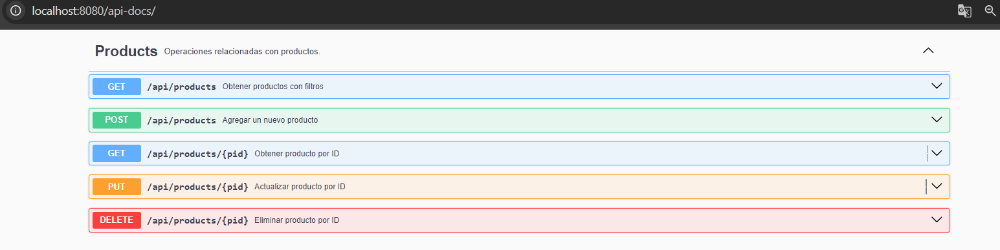
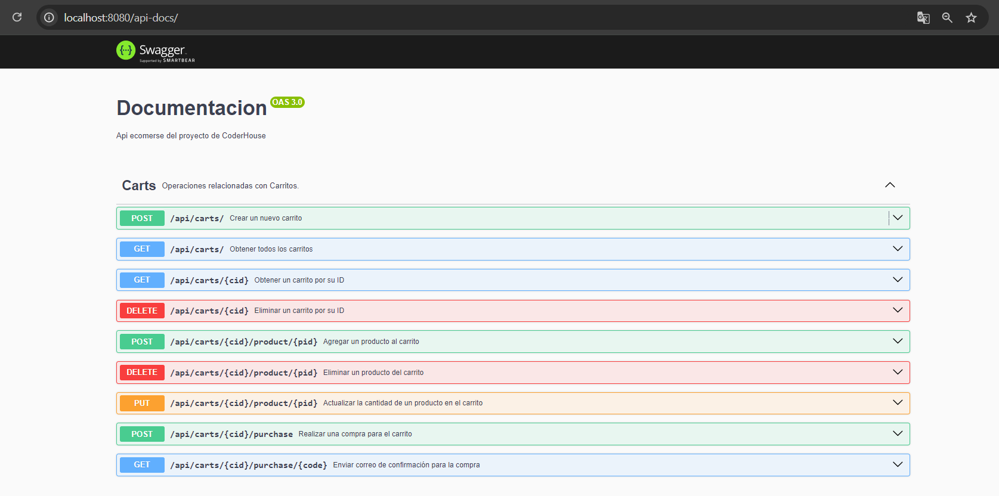
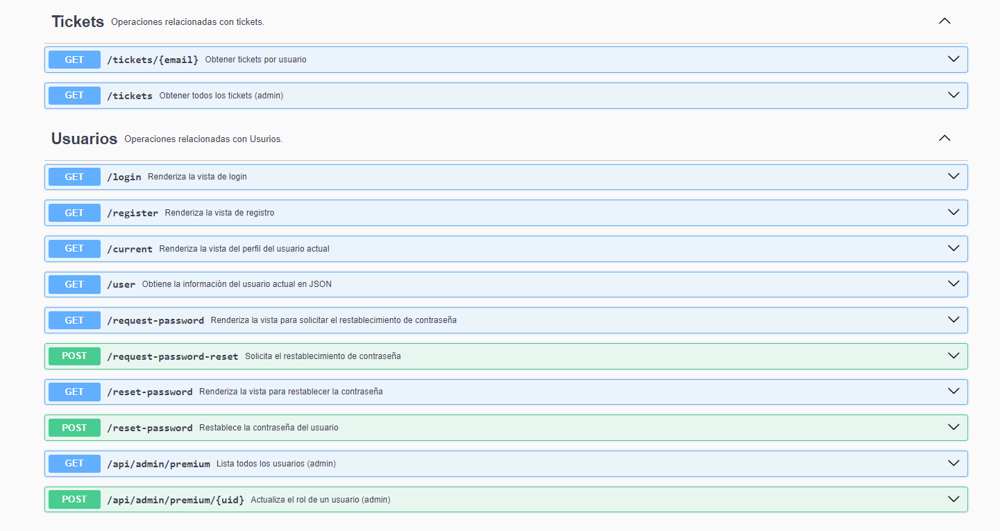
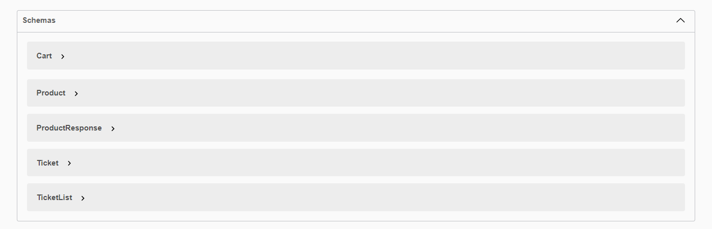

### Documentar API SOBRE TU ECOMMERCE

## DESAFÍO ENTREGABLE:

# Consigna

>Realizar la configuración necesaria para tener documentado
>tu proyecto final a partir de Swagger.

# Aspectos a incluir

> Se debe tener documentado el módulo de productos.

> Se debe tener documentado el módulo de carrito

> No realizar documentación de sesiones

